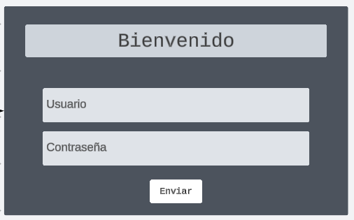

# API REST BACKEND
## NOTA: Para la tabla usuario, los atributos nombre y correo no se pueden repetir

## AUTHENTICACION

## - LOGIN

| 

 Direccion 

 | 
------------
| http://localhost:8080/auth/login |
------------

Ejemplo de variables a mandar en formato json

    "correo": "Royer@gmail.com",
    "password": "789654123"

### - Usuario voluntario
------------
| 

 Direccion 

 | 
------------
| http://localhost:8080/auth/registerVol |
------------

Ejemplo de variables a mandar en formato json

    "nombre": "Gemini",  
    "apellido": "Ramos",    
    "password": "1232456789",  
    "correo": "Minion@gmail.com",  
    "ubicacion": "Perez",  
    "telefono": 798541260,  
    "edad": 18,  
    "turno": "Tarde",  
    "horario": "15:32-20:00"  

### - Formulario para el usuario y la organizacion benefica
------------
| 

 Direccion 

 | 
------------
| http://localhost:8080/auth/registerOB |
------------

Ejemplo de variables a mandar en formato json

    "nombre": "Robert",
    "apellido": "migo",
    "password": "15354ler",
    "correo": "minio@minion.com",
    "ubicacion": "Perez",
    "telefono": 1598328,
    "tipoAlimento": "lacteos",
    "ubicacionO": "Perez",
    "areaServicio": "no se",
    "nombreOrg": "minions"

### - Formulario para el usuario y la organizacion Receptora
------------
| 

 Direccion 

 | 
------------
| http://localhost:8080/auth/registerOR |
------------

Ejemplo de variables a mandar en formato json

    "nombre": "Alvarez",
    "apellido": "royer",
    "password": "789654123",
    "correo": "Royer@gmail.com",
    "ubicacion": "Colombia",
    "telefono": 1234567,
    "tipoOrg": "super",
    "ubicacionO": "PerezO",
    "nombreOrg": "anonimo"

### - Retorno de al autenticarse

Al registrar o entrar por login se devolvera un token 

